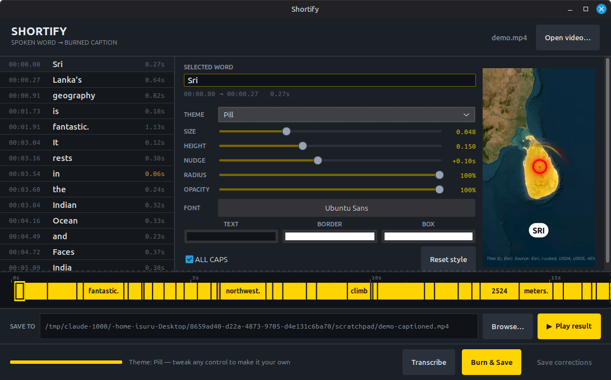

# Shortify

Burn one-word-at-a-time captions onto vertical videos. White text, black outline,
yellow box — the caption style used by most short-form video.

Transcription runs **entirely on your machine** via [whisper.cpp](https://github.com/ggml-org/whisper.cpp).
No API keys, no uploads, no per-minute cost.



## Why

Most caption tools either send your audio to a server or make you re-do the styling by hand
for every video. This does neither: the style lives in a config, so every video comes out
identical, and the audio never leaves the machine.

The interesting part is the **word ribbon** along the bottom. Each chip is as wide as that
word's duration, so timing errors are visible as shape — a word that hangs too long is a fat
chip, a silent stretch is a hole in the strip. Click a chip to jump there.

## Install

Needs `ffmpeg`, `python3`, `python3-gi` (GTK 3) and a C++ toolchain.

```bash
git clone https://github.com/<you>/shortify.git
cd shortify
./setup.sh            # builds whisper.cpp, downloads the base model (~190 MB, once)
./install.sh          # per-user install: no root, nothing outside $HOME
```

`install.sh` adds a `shortify` command, a menu entry under Sound & Video, and icons.
It runs the app straight from the source tree, so `git pull` updates it with no reinstall.
`./install.sh --uninstall` removes everything it added and leaves your settings alone.

To skip installing and just run it:

```bash
python3 gui/ui.py
```

On Debian/Ubuntu/Mint the dependencies are:

```bash
sudo apt install ffmpeg python3-gi python3-gi-cairo gir1.2-gtk-3.0 cmake build-essential
```

## Use

**App** — `python3 gui/ui.py`, then drag a video in. Transcribe, fix any wrong words in the
ledger, adjust the style while watching the preview, hit Burn.

- **Sample word** renders your style onto the video before you transcribe anything, so the
  sliders do something visible from the moment a file is loaded — type any word to try it
- **Save location** is shown and editable before you render — change it inline or via Browse
- **Play** opens the captioned file once it exists, the original before that
- **Colours** for letter fill, letter outline and box are set independently
- **Font** picker covers anything installed on the system
- **Arrow keys** walk the word list; **Enter** saves a correction and jumps to the next word
- **Amber chips** flag words whose timing looks wrong — under 0.1 s or over 1.6 s
- **Burn is cancellable**, and every style setting persists to `~/.config/shortify/settings.json`

**Command line** — same engine, no window:

```bash
python3 shortify.py video.mp4
python3 shortify.py video.mp4 --reuse --boxcolor 00E5FF --fontscale 0.045
```

| Flag | Default | Meaning |
|---|---|---|
| `--fontscale` | `0.050` | Text height as a fraction of frame height |
| `--marginscale` | `0.135` | Distance off the bottom, same units |
| `--offset` | `0.10` | Shift every caption later, in seconds |
| `--boxcolor` | `FFD400` | Box fill, hex RGB |
| `--textcolor` | `FFFFFF` | Letter fill, hex RGB |
| `--bordercolor` | `000000` | Letter outline, hex RGB |
| `--no-upper` | off | Keep original case instead of ALL CAPS |
| `--reuse` | off | Reuse the cached transcript — restyle in seconds |

## Getting names right

Whisper mangles proper nouns. Two files fix that permanently:

- **`vocab.txt`** — terms you use often, one per line. They prime the recogniser before it
  listens.
- **`fixes.txt`** — `wrong => right` replacements applied afterwards. Multi-word allowed when
  both sides have the same word count.

The app's **Save corrections** button appends to `fixes.txt` automatically, so a word you fix
once is fixed for every future video.

## Speed

Measured on a 2-core i3-5005U, the slowest thing to hand:

| Step | 60-second video |
|---|---|
| Transcribe | ~60 s |
| Burn | ~60 s |

Roughly real time end to end. A faster CPU is proportionally quicker.

## Design

See [DESIGN.md](DESIGN.md) — the reference, the signature move, and the token layer.

## Licence

MIT.
